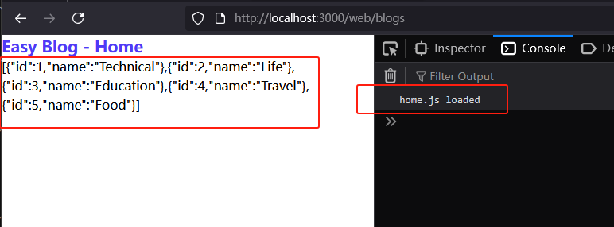
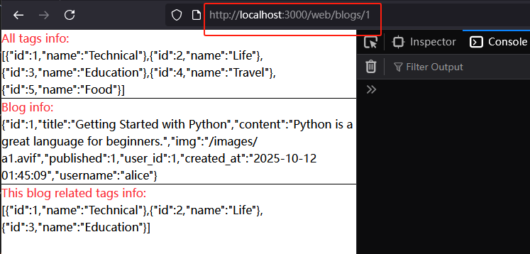

[返回首页](../Readme.md)

# 设计WEB路由

## src/routes/web目录 
- 新增blogs.ts, admin.ts，采用如下的框架；
```javascript
import express from "express";
const router = express.Router();

router.get("/", (req, res) => {
    res.json({message: "web route home"});
});

export default router;
```
- 新增index.ts，采用类似如下的框架：
```javascript
import blogs from "./blogs.ts";
import admin from "./admin.ts";

export { blogs, admin };
```

## src/index.ts
- import刚刚配置的web路由，并且设置具体的路径，这个案例中是“/web/blogs”和“/web/admin”；
- 将首页路由重定向到/web/blogs；

## 完善 src/routes/web/blogs.ts 中的blog首页路由
- 首页上，我们希望能够显示所有的tags，以便后续根据tag过滤blog
- 我们还希望显示最新的blog列表
- 这里我们准备采用serverside rendering和clientside rendering结合的方式来实现
- 其中，tags通过serverside rendering实现，即由服务器直接渲染到ejs中
- 其中，blogs列表通过clientside rendering实现，即由客户端读取js脚本后自己去fetch api路由，然后渲染到页面中
- 在public/js下面新建一个home.js，以供home.ejs调用

## 完善 src/routes/web/blogs.ts 中的单个blog页面路由
- 单个blog页面，我们就简单点，所有内容都由服务器渲染。

## 简单设计一下blog.ejs和home.ejs，server side rendering的内容，直接用JSON.stringify打印到网页上
- Blog首页效果

- 单个blog页面的效果

- 可以看到，由serverside rendering的内容，可以直接显示在网页上，接下来的工作就是用html和css来格式化显示；
- 由clientside rendering的内容，还有待于我们编写home.js脚本，现在只有一句简单的console.log;


## 至此web路由的框架设计完成！
