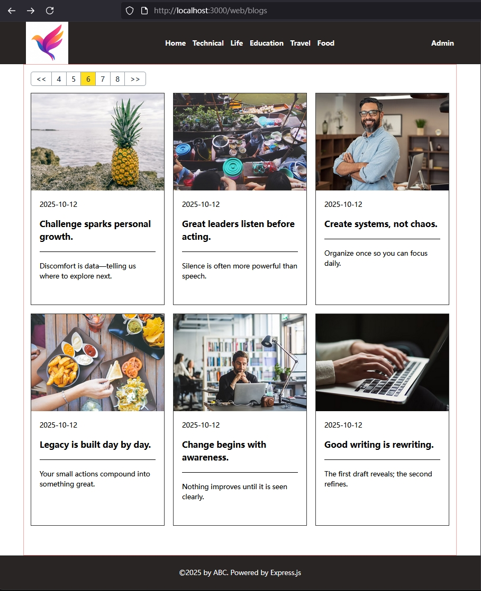
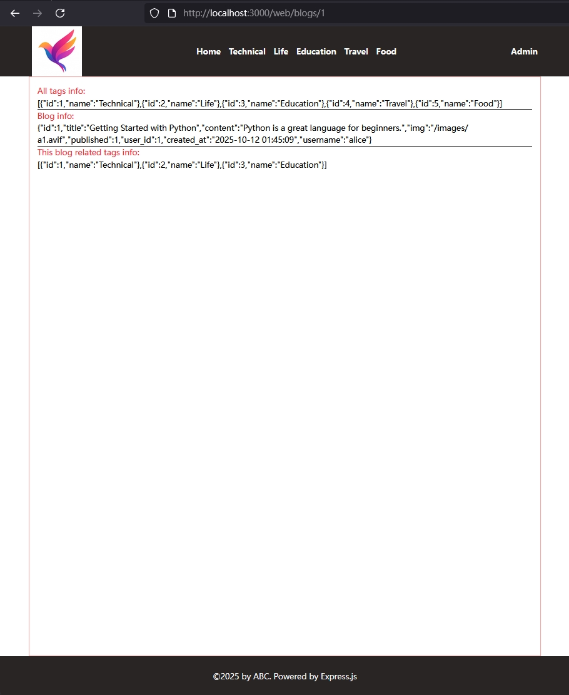
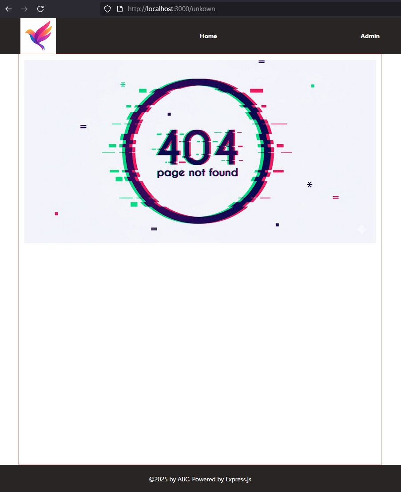

[返回首页](../Readme.md)

# WEB页面实现

## blogs首页
- 重新设计ejs，将header和footer抽取出来，放在views/partial中；
- 在home.ejs, error.ejs, blog.ejs中 include header.ejs和footer.ejs；
- 在frontend文件夹内写home.ts脚本，从api获取blog信息，然后写到container div中去；
- 在frontend目录中开启tsc -w，将ts脚本转换到backend/public/js/中去；
- 设计分页显示按钮，能分页查询blog

## 单个blog的页面
- 现在暂时使用最原始的版本，直接用JSON.stringify查看server rendering过来的内容即可

## 目前实施效果如下：
- 首页

- 单blog页

- 404页
