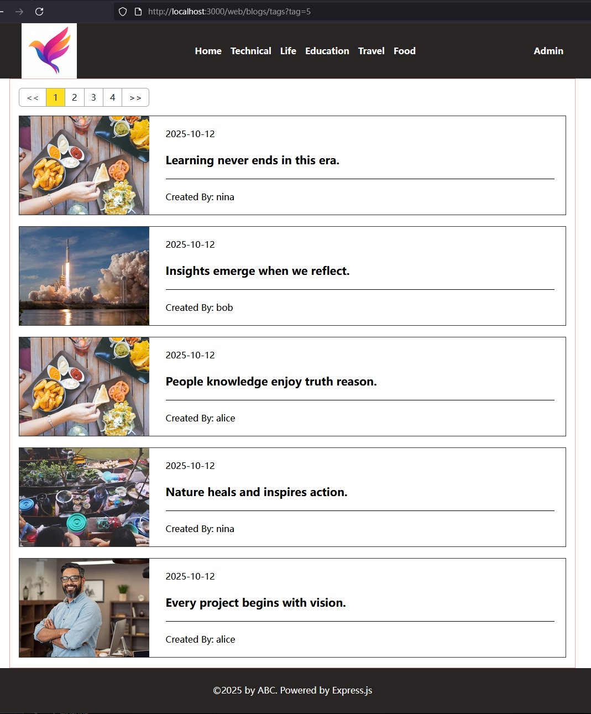

[返回首页](../Readme.md)

# 基于tag查询blog的WEB页面实现

## src/routes/web/blogs.ts中增加基于tag查询的路由
- 实现“ http://localhost:3000/web/blogs/tags?tag=1 ” 路由的处理
- 这个页面我们准备页采用类似home页面的client side rendering来实现，因此可以复用home.ejs
- 要依靠backend/public/js/tag.js来实现前端页面渲染，因此需要在frontend/src中写tag.ts
- 修改backend/public/css/input.css中的样式，以实现布局

## 目前实施效果如下：
- 基于tag查询的页面
