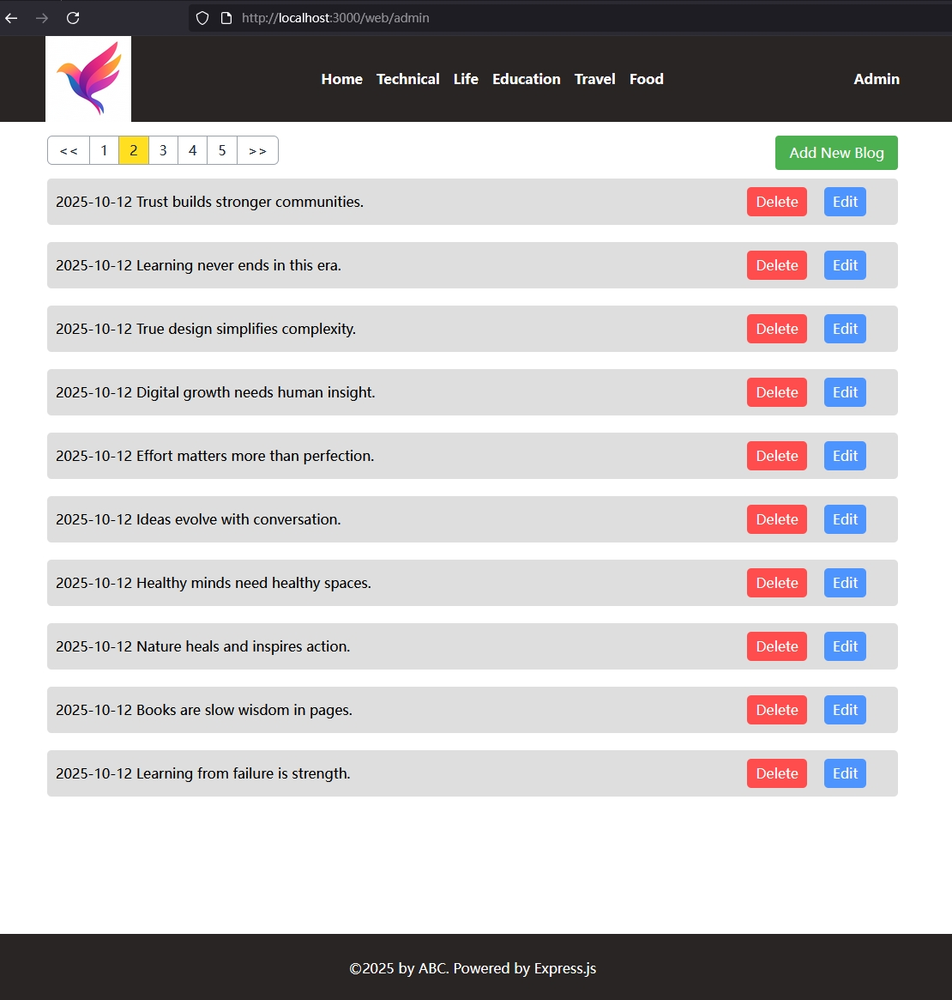

[返回首页](../Readme.md)

# admin WEB页面实现

## src/routes/web/admin.ts中增加相关路由
- admin首页负责展示所有blog列表，提供删除、编辑、新增的按钮
- 提供增加blog的页面
- 提供修改blog的页面

## 以上页面采用何种技术实现（CSR / SSR），可以自己的选择，示例代码采用如下方案
- admin首页面采用CSR
- add/edit页面采用SSR，但是按钮动作依旧由JS脚本负责

## 目前实施效果如下：
- admin页面

- add blog页面

- edit blog页面

- 附加任务：在删除blog的时候，使用自定义遮罩层和确认对话框
